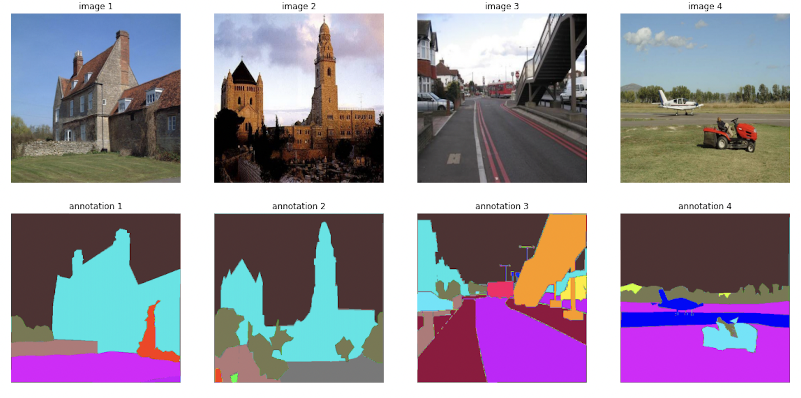

# Semantic Segmentation with Edge Supervision

### Author: Kexin Yang, Ling Feng

This repository contains our source code and experiment results for MIT 6.869 Final Project. For more details, please refer to our report.

### Abstract
Improving boundary segmentation has been a concern for semantic segmentation tasks for a long time. In this project, we propose three new deep learning models with edge supervision for pixel-wise segmentation. The main idea of our proposed architectures includes a Segmentation Net for segmentation prediction and three variants of edge supervision methods, and they are combined to give the final segmentation result. The loss function is a weighted sum of segmentation prediction loss and edge classification loss, and the gradient will back-propagate through the Segmentation net and Edge net correspondingly. The three proposed architectures share the same idea but have difference in implementation details. The U-Net model is used as a baseline for comparison.

All models were trained on half of the ADE20K Dataset for 30 epochs with the same hyper-parameter. The experiment results indicate that our proposed models have better performance on all three measures including pixel accuracy, top 50 IoU, and weighted IoU. We also noticed that each model achieved highest performance in one of the three measures, which suggests that different methods of edge supervision allows the models to learn different types of object segmentation better. This is also supported by our analysis of model IoU across 151 individual object classes.

### Dataset Review
We trained the model and did experiment on ADE20K dataset, Here is a visualization of the dataset:

### Models

#### Model 1 - Binary Edge Supervision

#### Model 2 - Multi-class Edge Supervision

#### Model 3 - Pre-trained EdgeNet

### Results

#### Evaluation Metrics

|   Model  | Pixel Accuracy | Weighted IoU | Mean IoU 50 |
|:--------:|:--------------:|:------------:|:-----------:|
| Baseline |      55.5      |     38.45    |    17.66    |
|  Model 1 |      57.4      |   **41.41**  |    20.47    |
|  Model 2 |    **57.9**    |     38.50    |    18.46    |
|  Model 3 |      57.2      |     41.22    |  **22.15**  |

#### Visualizations

